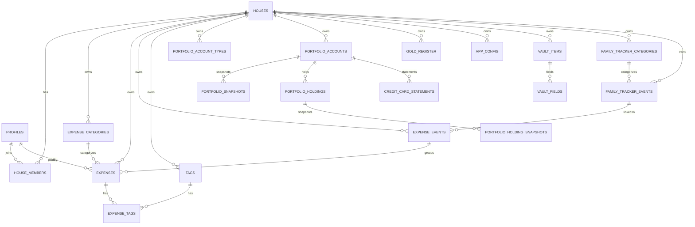

## sk-illam — design (scratch v2)

### Product scope (modules)
- **Illam**: house selector + summary dashboard
- **Selavu**: expense tracking + reports/insights
- **Selvam**: portfolio / net worth tracking
- **Padhivu**: shared household vault (records)
- **Family Tracker**: recurring family calendar/tasks

### Tenancy + access model
- **Tenant = House**.
- A user can belong to multiple houses.
- **All data is shared within a house** (including Vault/Padhivu).
- Access control is enforced in the DB via **Row Level Security** using `tenant_id` and house membership.

### Design principles
- **Every domain row has `tenant_id`** (no cross-tenant joins without explicit intent).
- APIs are **tenant-aware**: server resolves active tenant; clients never send arbitrary `tenant_id`.
- Prefer **UUID primary keys**, `created_at/updated_at`, and `created_by` for auditability.

### Core entities (database-first)

#### Shared primitives
- `houses`
- `house_members` (user ↔ house)
- `profiles` (1:1 with auth user; includes `active_house_id`)

#### Selavu (expenses)
- `expense_categories`
- `expenses`
- `expense_events`
- `tags`
- `expense_tags` (junction)
- `insights_cache` (optional, tenant-scoped)

#### Selvam (portfolio)
- `portfolio_account_types`
- `portfolio_accounts`
- `portfolio_snapshots`
- `portfolio_holdings`
- `portfolio_holding_snapshots`
- `credit_card_statements`
- `gold_register`
- `app_config` (tenant-scoped key/value)

#### Padhivu (vault)
- `vault_items`
- `vault_fields`

#### Family Tracker
- `family_tracker_categories`
- `family_tracker_events`

### Entity Relationships (ERD)

### Notes on specific relationships
- **House membership** is the root authorization primitive: if a user is a member of the active house, they can read/write the house’s data (optionally constrained by role).\n+- **Expenses ↔ Tags** is many-to-many through `expense_tags` with a unique constraint on `(expense_id, tag_id)`.\n+- **Family Tracker → Expense Events**: optional link so an expense-event bucket (e.g. “Gas Cylinder”) can reference a tracker event.\n+\n+### RLS policy shape (Supabase)
All tenant tables:\n+- `SELECT`: allow if `exists (select 1 from house_members hm where hm.house_id = tenant_id and hm.user_id = auth.uid())`\n+- `INSERT`: same, plus `created_by = auth.uid()`\n+- `UPDATE/DELETE`: same (optionally restrict by role)\n+\n+### Open design decisions (later)
- Role model (`owner/admin/member`) and what operations require elevated rights.\n+- Vault hardening (optional): client-side encryption vs shared-house masking only.\n+\n*** End of File
